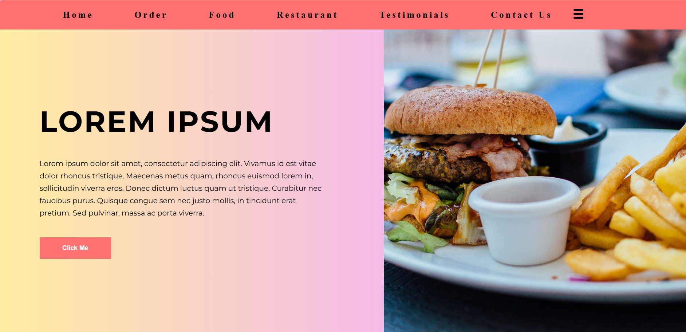

# Restaurant Landing Page

A clean and modern restaurant landing page built using only HTML and CSS.  
The design focuses on simplicity, strong visuals, and balanced layout.

## Features
- Gradient background layout
- Centered navigation bar
- Responsive image masonry section
- Feature text box aligned with images
- Two-word line split for headings
- Fully responsive design

## Technologies Used
- HTML5
- CSS3
- Google Fonts (Montserrat)

## Project Structure
- index.html
- style.css
- README.md

## How to Run
Open `index.html` in any modern web browser.

## Purpose
This project was created to practice modern CSS layouts, flexbox alignment, and responsive design using pure HTML and CSS.

## License
Free to use for learning and personal projects.
